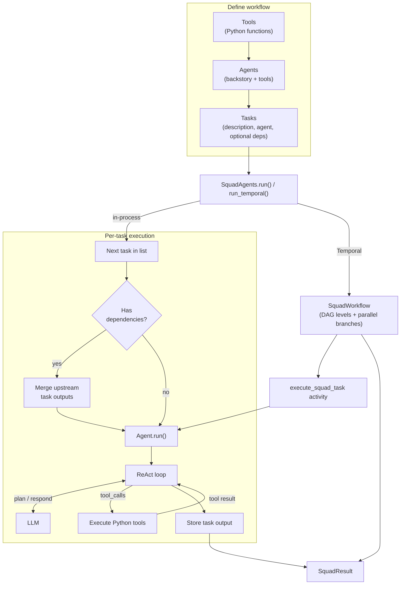

## SquadAI

SquadAI is a lightweight Python framework for orchestrating multiple AI agents, tools, and dependent tasks. It helps you compose collaborative AI workflows where one task can consume the output of previous tasks.

## What this project does

SquadAI provides a simple abstraction layer around:

- **Agents**: role-based workers with backstory/prompts (`squadAI/createAgent.py`)
- **Tools**: Python functions wrapped as callable tools for agents (`squadAI/tools.py`)
- **Tasks**: structured units of work assigned to agents (`squadAI/task.py`)
- **Orchestration**: in-process sequential runs plus durable Temporal workflows (`squadAI/squadAgent.py`, `squadAI/temporal/`)
- **ReAct-style execution loop**: tool-calling interaction with an LLM (`squadAI/reactAgent.py`)

At a high level, you define tools and agents, wire tasks together, and `SquadAgents` runs them in order—each task is handled by its assigned agent through an LLM tool-calling loop:



## Repository structure

```text
squadAI/
  __init__.py     # public API exports
  chat.py         # chat history helper (incl. native tool messages)
  createAgent.py  # Agent model and execution entrypoint
  config.py       # pydantic-settings (LLM, Temporal, agent defaults)
  llm.py          # LLM provider factory
  providers/      # LLM provider adapters (one module per backend)
  reactAgent.py   # ReAct loop with native tool calling
  squadAgent.py   # multi-task orchestrator
  temporal/       # Temporal workflow, activities, worker helpers
  task.py         # Task model
  tools.py        # Tool class and decorator wrapper
  utils.py        # function signature / JSON schema utilities
example_run.py    # runnable examples
temporal_worker.py # Temporal worker entrypoint
tests/            # unit tests (mock provider)
requirements.txt  # Python dependencies
```

## Core features

1. **Agent creation** with reusable backstories/prompts
2. **Tool integration** from normal Python functions via `@tool_wrapper`
3. **Task automation** with parameterized task templates (e.g. `{a}`, `{b}`)
4. **Task dependency chaining** where downstream tasks consume upstream output
5. **Multi-agent orchestration** through `SquadAgents.run()`

## Installation

### Prerequisites

- Python 3.10+ recommended
- Access to an LLM provider compatible with the configured client

### Setup

```bash
git clone https://github.com/skhanal123/squadAI.git
cd squadAI
python -m venv .venv
source .venv/bin/activate
pip install -r requirements.txt
```

## Environment configuration

Configuration is loaded via **pydantic-settings** from environment variables and a project-root ``.env`` file. See ``squadAI/config.py`` for the full schema.

Create a `.env` file in the project root:

```env
# Provider: openai | gemini | anthropic | deepseek | groq | openai_compatible | mock
LLM_PROVIDER=deepseek

# Model name (e.g. deepseek-chat, gpt-4o, gemini-2.0-flash, claude-sonnet-4-20250514)
LLM_MODEL=deepseek-chat

# Provider credentials (set the ones you use)
OPENAI_API_KEY=your_openai_key_here
GEMINI_API_KEY=your_gemini_key_here
ANTHROPIC_API_KEY=your_anthropic_key_here
DEEPSEEK_API_KEY=your_deepseek_key_here
GROQ_API_KEY=your_groq_key_here

# Optional overrides
LLM_API_KEY=your_api_key_here
LLM_BASE_URL=https://api.deepseek.com

# Agent defaults
REACT_MAX_ITERATIONS=4

# Include human-readable token summary in SquadResult.usage_display (billing fields always populated)
INCLUDE_USAGE_IN_RESULT=false
```

Provider modules live under `squadAI/providers/` (one file per backend: `openai.py`, `gemini.py`, `anthropic.py`, `deepseek.py`, `groq.py`, etc.).

Notes:

- Tool schemas are passed via the provider API; the model returns structured `tool_calls`.
- If `LLM_PROVIDER` is omitted, the provider is inferred from the model prefix: `deepseek-*`, `gemini-*`, `claude-*`, `gpt-*` / `o1-*` / `o3-*` / `o4-*`, else `groq`.
- Use `LLM_PROVIDER=openai_compatible` with `LLM_BASE_URL` for Ollama or other OpenAI-compatible hosts.
- Set `LLM_PROVIDER=mock` for offline tests (see `tests/test_native_tools.py`).

## Quick start

You can run the included examples:

```bash
python example_run.py
```

`example_run.py` demonstrates:

- Wrapping Python functions (`add_two_numbers`, `multiply_two_numbers`) as tools
- Creating specialized agents with those tools
- Defining dependent tasks where task 2 consumes task 1 output
- Running a squad with `SquadAgents(...).run(a=2, b=3, c=4)`

## How orchestration works

### In-process (`SquadAgents.run()`)

1. Validates that dependencies appear **earlier in the tasks list**.
2. Executes tasks sequentially in list order.
3. Merges upstream outputs into labeled context blocks for dependent tasks.

### Temporal (`SquadAgents.run_temporal()`)

1. Validates the dependency graph (missing deps and cycles) at squad construction.
2. Starts a durable `SquadWorkflow` on Temporal.
3. Executes each DAG level in parallel; dependent levels wait for upstream activities.
4. Each task runs inside the `execute_squad_task` activity (retries, timeouts, durability).

**Local Temporal setup:**

```bash
# Install Temporal CLI, then start dev server
temporal server start-dev

# Terminal 1 — worker (registers example tools)
python temporal_worker.py

# Terminal 2 — run a squad via Temporal from Python
python -c "
import asyncio
from squadAI.temporal.worker import create_temporal_client
from squadAI import Agent, Task, SquadAgents

async def main():
    agent = Agent(backstory='You are concise.')
    task = Task(task_description='Say hello in one sentence.', agent=agent)
    squad = SquadAgents(tasks=[task])
    client = await create_temporal_client()
    result = await squad.run_temporal(client)
    print(result.final)

asyncio.run(main())
"
```

Environment variables:

```env
TEMPORAL_ADDRESS=localhost:7233
TEMPORAL_TASK_QUEUE=squadai
```

Both paths ultimately call `Agent.run()` → `ReactAgent.invoke()` with native tool calling.

## Token usage and billing

Every LLM completion records input/output token counts. Usage is aggregated per task (including ReAct loops and validation retries) and rolled up on `SquadResult`.

After `squad.run()`:

```python
result = squad.run()

# Per-task billing (model + tokens)
for tr in result.task_results:
    print(tr.usage.model, tr.usage.input_tokens, tr.usage.output_tokens)

# Squad totals keyed by model (apply your price table)
for model, tokens in result.usage_by_model.items():
    cost = your_price_fn(model, tokens.input_tokens, tokens.output_tokens)

# Optional customer-facing summary (does not affect billing fields)
result = squad.run(include_usage_in_result=True)
print(result.usage_display)
```

- `SquadResult.usage` — squad-wide token totals (all models combined).
- `SquadResult.usage_by_model` — tokens grouped by model name for cost calculation.
- `include_usage_in_result` — when `True`, sets `usage_display`; usage fields are always populated regardless of this flag.

## Testing

Run unit tests with the mock provider (no API key required):

```bash
python -m unittest discover -s tests -v
```

## Development

To iterate locally:

```bash
python -m pip install --upgrade pip
pip install -r requirements.txt
python example_run.py
```

If you add new tools, ensure function annotations and docstrings are present so signature extraction remains useful.