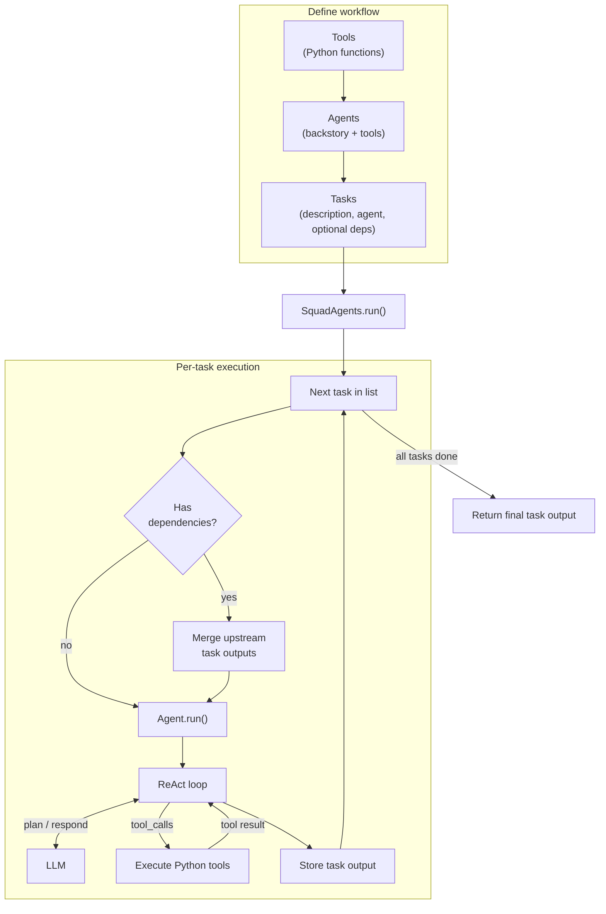

## SquadAI

SquadAI is a lightweight Python framework for orchestrating multiple AI agents, tools, and dependent tasks. It helps you compose collaborative AI workflows where one task can consume the output of previous tasks.

## What this project does

SquadAI provides a simple abstraction layer around:

- **Agents**: role-based workers with backstory/prompts (`squadAI/createAgent.py`)
- **Tools**: Python functions wrapped as callable tools for agents (`squadAI/tools.py`)
- **Tasks**: structured units of work assigned to agents (`squadAI/task.py`)
- **Orchestration**: sequential task execution with dependency context passing (`squadAI/squadAgent.py`)
- **ReAct-style execution loop**: tool-calling interaction with an LLM (`squadAI/reactAgent.py`)

At a high level, you define tools and agents, wire tasks together, and `SquadAgents` runs them in order—each task is handled by its assigned agent through an LLM tool-calling loop:



## Repository structure

```text
squadAI/
  __init__.py     # public API exports
  chat.py         # chat history helper (incl. native tool messages)
  createAgent.py  # Agent model and execution entrypoint
  llm.py          # LLM settings and provider factory
  providers/      # LLM provider adapters (OpenAI-compatible, Groq, mock)
  reactAgent.py   # ReAct loop with native tool calling
  squadAgent.py   # multi-task orchestrator
  task.py         # Task model
  tools.py        # Tool class and decorator wrapper
  utils.py        # function signature / JSON schema utilities
example_run.py    # runnable examples
tests/            # unit tests (mock provider)
requirements.txt  # Python dependencies
```

## Core features

1. **Agent creation** with reusable backstories/prompts
2. **Tool integration** from normal Python functions via `@tool_wrapper`
3. **Task automation** with parameterized task templates (e.g. `{a}`, `{b}`)
4. **Task dependency chaining** where downstream tasks consume upstream output
5. **Multi-agent orchestration** through `SquadAgents.run()`

## Installation

### Prerequisites

- Python 3.10+ recommended
- Access to an LLM provider compatible with the configured client

### Setup

```bash
git clone https://github.com/skhanal123/squadAI.git
cd squadAI
python -m venv .venv
source .venv/bin/activate
pip install -r requirements.txt
```

## Environment configuration

The runtime loads environment variables using `python-dotenv`.

Create a `.env` file in the project root:

```env
# Provider: openai_compatible | groq | mock
LLM_PROVIDER=openai_compatible

# Model name (e.g. deepseek-chat, llama-3.3-70b-versatile)
LLM_MODEL=deepseek-chat

# Provider credentials (set the ones you use)
DEEPSEEK_API_KEY=your_deepseek_key_here
GROQ_API_KEY=your_groq_key_here

# Optional overrides
LLM_API_KEY=your_api_key_here
LLM_BASE_URL=https://api.deepseek.com
```

Notes:

- Tool schemas are passed via the provider API; the model returns structured `tool_calls`.
- If `LLM_PROVIDER` is omitted, DeepSeek models (`deepseek-*`) use `openai_compatible`; other models default to `groq`.
- Set `LLM_PROVIDER=mock` for offline tests (see `tests/test_native_tools.py`).

## Quick start

You can run the included examples:

```bash
python example_run.py
```

`example_run.py` demonstrates:

- Wrapping Python functions (`add_two_numbers`, `multiply_two_numbers`) as tools
- Creating specialized agents with those tools
- Defining dependent tasks where task 2 consumes task 1 output
- Running a squad with `SquadAgents(...).run(a=2, b=3, c=4)`

## How orchestration works

1. `SquadAgents.run()` iterates through tasks in order.
2. If a task has dependencies, dependent task outputs are concatenated into context.
3. The assigned `Agent.run()` formats the task description with runtime kwargs.
4. `ReactAgent.invoke()` executes an LLM loop via a **provider adapter**:
   - sends OpenAI-compatible tool schemas to the LLM
   - executes structured `tool_calls` and feeds back `role: tool` results
   - returns the final answer when the model stops calling tools

## Current limitations and notes

- Task execution order is list-based and sequential.
- Dependency context is currently concatenated as plain text.
- The codebase is intentionally small and aimed at experimentation and learning.

## Testing

Run unit tests with the mock provider (no API key required):

```bash
python -m unittest discover -s tests -v
```

## Development

To iterate locally:

```bash
python -m pip install --upgrade pip
pip install -r requirements.txt
python example_run.py
```

If you add new tools, ensure function annotations and docstrings are present so signature extraction remains useful.