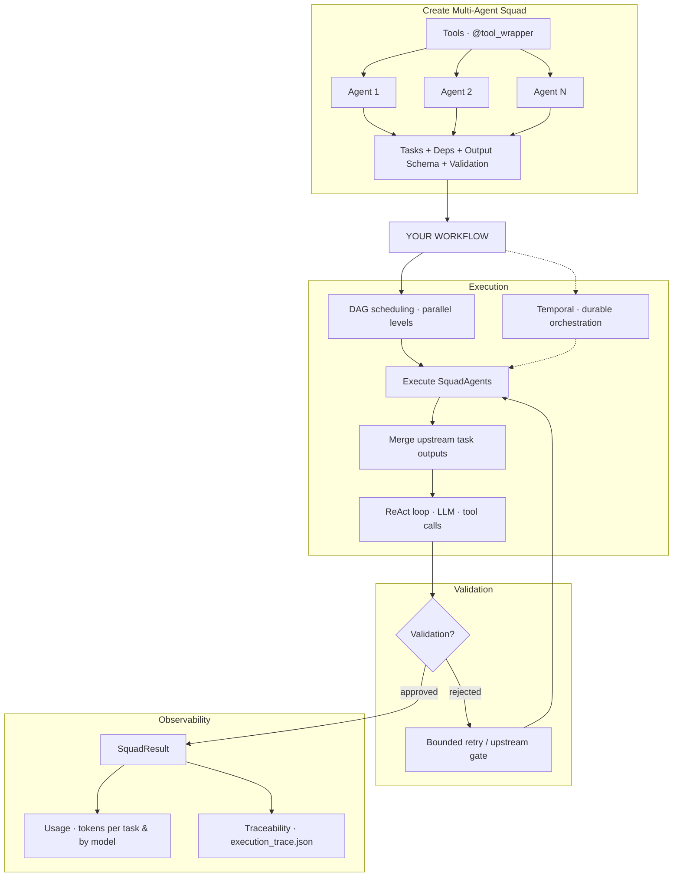

## SquadAI

SquadAI is a lightweight Python framework for **orchestrating multi-agent AI workflows** — wiring specialized agents, tools, and interdependent tasks with full observability.

## What this project does

Run collaborative multi-agent workflows with DAG-based orchestration, native tool calling, automatic context passing between dependent tasks, output validation, and built-in usage and trace observability — without assembling those pieces yourself.

**Key moving parts:**

- **Tools** — Python functions exposed to the LLM via `@tool_wrapper`
- **Agents** — specialized workers (backstory, tools, iteration limits) assigned to individual tasks
- **Tasks** — units of work with dependencies, optional `output_schema`, and optional validators
- **SquadAgents** — workflow orchestrator; schedules tasks by DAG level, runs independent branches in parallel, in-process or via Temporal
- **ReAct loop** — per-task LLM execution cycle: plan, call tools, observe results, respond
- **Validation** — bounded retries on rejected output; upstream gates re-run earlier tasks until approved
- **SquadResult** — aggregated task outputs, token usage (per task and by model), and optional execution traces

Define your squad, call `SquadAgents.run()`, and each task runs through its assigned agent. Downstream tasks receive upstream outputs as context; validation and observability are captured on every run.



## Core features

1. **Multi-agent squads** — different agents (backstory, tools, iteration limits) handle different tasks in the same workflow
2. **DAG workflow management** — task dependencies form a directed graph; independent branches run in parallel; cycles and missing deps are caught at squad construction
3. **Interdependent task context** — downstream tasks receive upstream outputs as labeled `<context>` blocks automatically
4. **Native tool calling** — ReAct loop with provider-native `tool_calls`; expose Python functions via `@tool_wrapper`
5. **Structured output** — optional Pydantic `output_schema` on tasks for typed JSON results
6. **Validation gates** — per-task validators with bounded retries; upstream gates re-run earlier tasks until output is approved
7. **Token usage tracking** — input/output tokens aggregated per task, per model, and squad-wide on `SquadResult` (including ReAct loops and validation retries)
8. **Execution traceability** — optional `execution_trace.json` with agent steps, validation rounds, and DAG level metadata (`trace_output_dir`)
9. **Multi-provider LLM support** — OpenAI, Anthropic, Gemini, Groq, DeepSeek, and OpenAI-compatible endpoints (Ollama, etc.)
10. **Temporal integration** — durable orchestration via `run_temporal()` for production workloads with parallel DAG branches

## Installation

### Prerequisites

- Python 3.10+ recommended
- Access to an LLM provider compatible with the configured client

### Setup

```bash
git clone https://github.com/skhanal123/squadAI.git
cd squadAI
python -m venv .venv
source .venv/bin/activate
pip install -r requirements.txt
```

## Environment configuration

Configuration is loaded via **pydantic-settings** from environment variables and a project-root ``.env`` file. See ``squadAI/config.py`` for the full schema.

Create a `.env` file in the project root:

```env
# Provider: openai | gemini | anthropic | deepseek | groq | openai_compatible | mock
LLM_PROVIDER=deepseek

# Model name (e.g. deepseek-chat, gpt-4o, gemini-2.0-flash, claude-sonnet-4-20250514)
LLM_MODEL=deepseek-chat

# Provider credentials (set the ones you use)
OPENAI_API_KEY=your_openai_key_here
GEMINI_API_KEY=your_gemini_key_here
ANTHROPIC_API_KEY=your_anthropic_key_here
DEEPSEEK_API_KEY=your_deepseek_key_here
GROQ_API_KEY=your_groq_key_here

# Optional overrides
LLM_API_KEY=your_api_key_here
LLM_BASE_URL=https://api.deepseek.com

# Agent defaults
REACT_MAX_ITERATIONS=4

# Include human-readable token summary in SquadResult.usage_display (billing fields always populated)
INCLUDE_USAGE_IN_RESULT=false
```

Provider modules live under `squadAI/providers/` (one file per backend: `openai.py`, `gemini.py`, `anthropic.py`, `deepseek.py`, `groq.py`, etc.).

Notes:

- Tool schemas are passed via the provider API; the model returns structured `tool_calls`.
- If `LLM_PROVIDER` is omitted, the provider is inferred from the model prefix: `deepseek-*`, `gemini-*`, `claude-*`, `gpt-*` / `o1-*` / `o3-*` / `o4-*`, else `groq`.
- Use `LLM_PROVIDER=openai_compatible` with `LLM_BASE_URL` for Ollama or other OpenAI-compatible hosts.
- Set `LLM_PROVIDER=mock` for offline tests (see `tests/test_native_tools.py`).

## Quick start

You can run the included examples:

```bash
python example_run.py
```

`example_run.py` demonstrates:

- Wrapping Python functions (`add_two_numbers`, `multiply_two_numbers`) as tools
- Creating specialized agents with those tools
- Defining dependent tasks where task 2 consumes task 1 output
- Running a squad with `SquadAgents(...).run(a=2, b=3, c=4)`

## How orchestration works

### In-process (`SquadAgents.run()`)

1. Validates that dependencies appear **earlier in the tasks list**.
2. Executes tasks sequentially in list order.
3. Merges upstream outputs into labeled context blocks for dependent tasks.

### Temporal (`SquadAgents.run_temporal()`)

1. Validates the dependency graph (missing deps and cycles) at squad construction.
2. Starts a durable `SquadWorkflow` on Temporal.
3. Executes each DAG level in parallel; dependent levels wait for upstream activities.
4. Each task runs inside the `execute_squad_task` activity (retries, timeouts, durability).

Both paths ultimately call `Agent.run()` → `ReactAgent.invoke()` with native tool calling.

## Token usage and billing

Every LLM completion records input/output token counts. Usage is aggregated per task (including ReAct loops and validation retries) and rolled up on `SquadResult`.

Token fields are always populated on `SquadResult` — use them for billing or cost tracking after `squad.run()`:

```python
result = squad.run()

# Per-task: model name and token counts
for tr in result.task_results:
    print(tr.usage.model, tr.usage.input_tokens, tr.usage.output_tokens)

# Squad-wide totals grouped by model — plug in your own price table
for model, tokens in result.usage_by_model.items():
    cost = your_price_fn(model, tokens.input_tokens, tokens.output_tokens)

# Optional human-readable summary (set INCLUDE_USAGE_IN_RESULT=true or pass include_usage_in_result=True)
result = squad.run(include_usage_in_result=True)
print(result.usage_display)
```

Notes:

- `result.task_results[].usage` — per-task tokens (model, input, output).
- `result.usage_by_model` — squad totals keyed by model for cost calculation.
- `result.usage` — combined squad-wide token totals across all models.
- `result.usage_display` — formatted summary string; only set when `include_usage_in_result=True`.

## Testing

Run unit tests with the mock provider (no API key required):

```bash
python -m unittest discover -s tests -v
```

## Development

To iterate locally:

```bash
python -m pip install --upgrade pip
pip install -r requirements.txt
python example_run.py
```

If you add new tools, ensure function annotations and docstrings are present so signature extraction remains useful.
